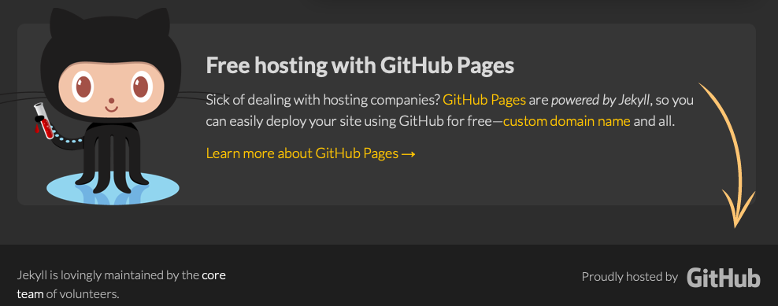
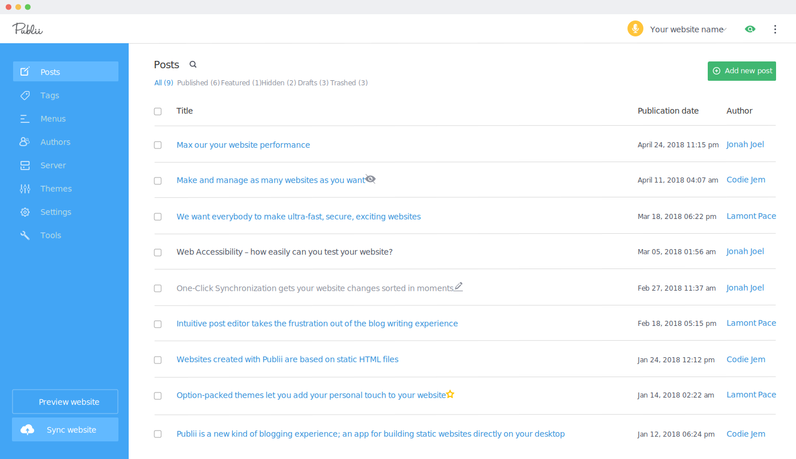
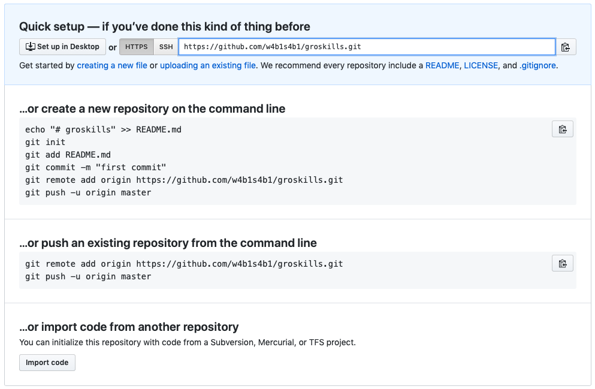
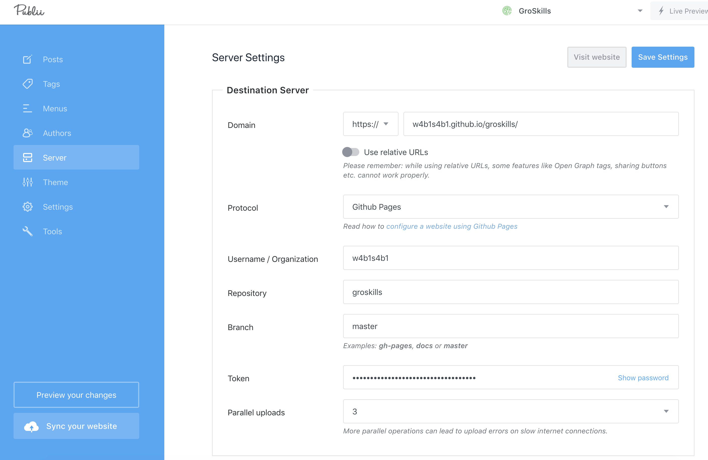
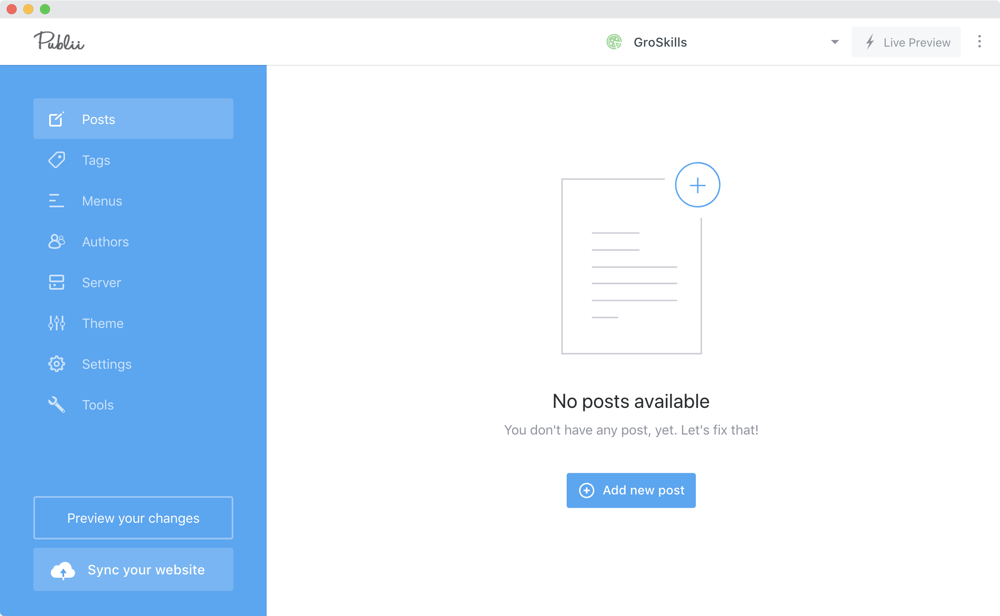

<!-- .slide: data-menu-title="Title slide" data-background-image="images/IMG_1228.jpg" data-background-opacity="0.4" -->
## Website hosting met GitHub

---

<!-- .slide: data-menu-title="Eigen website?" -->

## Een eigen website?

- Wordpress, Joomla, Drupal
- Jekyll, Hugo
- Nog geen website
- Waarom zou ik dat willen?

---

## Wat is een website?

Het eindproduct wordt getoond in een browsert maar wat gebeurt er onder water:

- HTML                  <!-- .element: class="fragment" data-fragment-index="1" -->
- CSS                   <!-- .element: class="fragment" data-fragment-index="2" -->
- JavaScript            <!-- .element: class="fragment" data-fragment-index="3" -->
- Webserver (host)      <!-- .element: class="fragment" data-fragment-index="4" -->
  - Statische content, plaatjes e.d.   <!-- .element: class="fragment" data-fragment-index="5" -->
  - Dynamische content, code  <!-- .element: class="fragment" data-fragment-index="6" -->

---

## Content Management Systeem

- Online CMS:
  - Dynamische websites

- Offline CMS
  - Statische websites

---

<!-- .slide: data-menu-title="Dynamische websites" -->
## Dynamische websites

- Wordpress
- Joomla
- Drupal
- etc.

--

<!-- .slide: data-menu-title="Statische websites?" data-background-image="https://media.giphy.com/media/LF8plQNlgYwnK/giphy.gif" data-background-opacity="0.4" -->
## Statische website?

--

<!-- .slide: data-menu-title="Statische website" -->
### Statische website:
- geen database back-end
- pagina's bestaan uit:
  - HTML
  - CSS
  - client-side JavaScript
- content is statisch
  - betere caching
  - betere performance
- veilig

--

<!-- .slide: data-menu-title="Voorbeeld sites" data-background-image="images/tig_transparent.png" data-background-opacity="0.1" -->
## Voorbeeld sites

### [devNetNoord](https://devnetnoord.github.io)

### [WabiSabi](https://wabisabi.dev)

### ['t is goud](https://tisgoud.nl)

--

<!-- .slide: data-menu-title="StaticGen" data-background-image="images/StaticGen.png" data-background-opacity="0.1" -->
## Static Site Generators

### [StaticGen](https://www.staticgen.com)

A List of Static Site Generators for JAMstack Sites

--

<!-- .slide: data-menu-title="Headless CMS" data-background-image="images/headless_cms.png" data-background-opacity="0.1" -->
## CMS for Static Sites

### [Headless CMS](https://headlesscms.org)

A List of Content Management Systems for JAMstack Sites

--

<!-- .slide: data-menu-title="JAMstack" data-background-image="images/JAM.png" data-background-opacity="0.1" -->
## JAMstack

### [JAMstack](https://jamstack.org)

noun \’jam-stak’\

Modern web development architecture based on client-side JavaScript, reusable APIs, and prebuilt Markup.

--

<!-- .slide: data-menu-title="Britans eyes" data-background-image="images/eyes.jpg" data-background-opacity="0.4" -->

---

<!-- .slide: data-menu-title="Website hosting" data-background-image="images/markdown-mark.svg" data-background-opacity="0.1" -->
## Website hosting, de mogelijkheden ...

- Eigen server hosten
- Webserver als dienst
- Website als dienst
- ~~Website genereren als dienst~~
- GitHub Pages, GitLab Pages of BitBucket Pages

--

## Eigen server?

Beveiliging?

Hoe richt je je server in?

Waar staat je server?

Heb je voldoende bandbreedte?

--

## Webserver als dienst?

Beveiliging?

Hoe richt je je webserver in?

Welke hoster kies je?

Wat kost het om je server te hosten?

--

## Website als dienst?

Welke hoster kies je?

Wat zijn de mogelijkeden?

Inclusief SSL certificaat?

Kosten?

--

<!-- .slide: data-menu-title="GitHub, GitLab of BitBucket" data-background-image="images/git-logo.png" data-background-opacity="0.1" -->

## GitHub, GitLab of BitBucket

Online code repositories

Wat is de link met website hosten?

--

<!-- .slide: data-menu-title="Britans eyes" data-background-image="images/questionmarks.jpg" data-background-opacity="0.4" -->

---

<!-- .slide: data-menu-title="Git wikipedia" data-background-image="images/git-logo.png" data-background-opacity="0.1" -->
## Git

Git is a distributed version-control system for tracking changes in source code during software development.

It is designed for coordinating work among programmers, but it can be used to track changes in any set of files.

Its goals include speed, data integrity, and support for distributed, non-linear workflows.

[Wikipedia]

--

<!-- .slide: data-menu-title="git clone" data-background-image="images/git-logo.png" data-background-opacity="0.1" -->
## Git clone

Het ophalen van bestanden uit een repository

```
git clone https://github.com/repository/project.git
```

Een voorbeeld ...

```
$ git clone https://github.com/repository/project.git project
Cloning into 'ananke'...
remote: Enumerating objects: 17, done.
remote: Counting objects: 100% (17/17), done.
remote: Compressing objects: 100% (15/15), done.
remote: Total 1349 (delta 3), reused 13 (delta 2), pack-reused 1332
Receiving objects: 100% (1349/1349), 4.14 MiB | 155.00 KiB/s, done.
Resolving deltas: 100% (722/722), done.
```

--

<!-- .slide: data-menu-title="git pull" data-background-image="images/git-logo.png" data-background-opacity="0.1" -->
## Git pull

Het ophalen van de laatste versie van een lokaal bestaand project

```
$ git pull
```

--

<!-- .slide: data-menu-title="git commit" data-background-image="images/git-logo.png" data-background-opacity="0.1" -->
## Git commit

Het documenteren van wijzigingen

```
$ git commit -m "typo in de pagina titel aangepast"
```

--

<!-- .slide: data-menu-title="git push" data-background-image="images/git-logo.png" data-background-opacity="0.1" -->
## Git push

Het uploaden van de lokale wijzigingen naar de repository

```
$ git push
```

--

<!-- .slide: data-menu-title="Git kennis nodig?" data-background-image="images/exploding_head.png" data-background-opacity="0.1" -->
## Is Git kennis echt nodig?

- Ja
- Nee
- Hangt ervan af...

---

<!-- .slide: data-menu-title="Webhosting bij een GitRepo" -->
## Webhosting bij een GitRepo

- GitHub
- GitLab
- BitBucket

--

<!-- .slide: data-menu-title="GitHub" data-background-image="images/Octocat.png" data-background-opacity="0.1" -->
## GitHub

yoursite.github.io

[GitHub Pages](https://pages.github.com)

--

<!-- .slide: data-menu-title="GitHub Octocat logo" -->
## GitHub's Octocat logo


--

<!-- .slide: data-menu-title="GitLab" data-background-image="images/gitlab.png" data-background-opacity="0.1" -->
## GitLab

yoursite.gitlab.io

[GitLab Pages](https://docs.gitlab.com/ee/user/project/pages/)

--

<!-- .slide: data-menu-title="BitBucket" data-background-image="images/bitbucket-icon.svg" data-background-opacity="0.1" -->

## BitBucket

yoursite.bitbucket.io

[Publishing a Website on Bitbucket Cloud](https://confluence.atlassian.com/bitbucket/publishing-a-website-on-bitbucket-cloud-221449776.html)

---

## Offline CMS

Website lokaal genereren en uploaden.

Wat zijn de mogelijkheden?

- Jekyll, meest populair
- Hugo, verreweg de snelste
- MkDocs, gericht op documentatie
- Publii, makkelijk in gebruik

---

<!-- .slide: data-menu-title="Jekyll" data-background-image="images/Jekyll.png" data-background-opacity="0.1" -->
## Jekyll



[https://jekyllrb.com](https://jekyllrb.com)

Geschreven in Ruby

---

<!-- .slide: data-menu-title="Hugo" data-background-image="images/Hugo_logo.png" data-background-opacity="0.1" -->
## Hugo


[https://gohugo.io](https://gohugo.io)

Geschreven in Go(lang)

--

<!-- .slide: data-menu-title="Hugo" data-background-image="images/Hugo_logo.png" data-background-opacity="0.1" -->
## Hugo website

[https://gohugo.io](https://gohugo.io)

- Documentatie
- Thema keuzes

--

<!-- .slide: data-menu-title="Hugo" data-background-image="images/Hugo_logo.png" data-background-opacity="0.1" -->
## Hugo source

---

<!-- .slide: data-menu-title="MkDocs" -->
## MkDocs


[www.mkdocs.org](https://www.mkdocs.org)

Geschreven in Python

--

MkDocs is a fast, simple and downright gorgeous static site generator that's geared towards building project documentation. Documentation source files are written in Markdown, and configured with a single YAML configuration file.

Note: Written in Python

---

<!-- .slide: data-menu-title="Publii" data-background-image="images/Publii.jpg" data-background-opacity="0.1" -->
## Publii

[getpublii.com](https://getpublii.com)

a new Static CMS with GUI to build an extremely
safe, fast and stylish HTML website.

Publii is a static-website-building tool for every skill level, from beginner to developer.

--

<!-- .slide: data-menu-title="Publii screenshot" data-background-image="images/Publii.jpg" data-background-opacity="0.1" -->
## Publii



--

<!-- .slide: data-menu-title="Publii demo" data-background-image="images/Publii.jpg" data-background-opacity="0.1" -->

## Publii demo

--

## Create a repo



--

## Upload some files

```
$ mkdir groskills
$ cd groskills
$ git init
Initialized empty Git repository in /Users/albert/Projects/w4b1s4b1/groskills/.git/

albert at RoadRunner in ~/Projects/w4b1s4b1/groskills on master
$ echo "GroSkils demo" > README.md

albert at RoadRunner in ~/Projects/w4b1s4b1/groskills on master [?]
$ git add README.md

albert at RoadRunner in ~/Projects/w4b1s4b1/groskills on master [+]
$ git commit -m "First Commit"
[master (root-commit) 83bf550] First Commit
 1 file changed, 1 insertion(+)
 create mode 100644 README.md

$ git push -u origin master
Enumerating objects: 3, done.
Counting objects: 100% (3/3), done.
Writing objects: 100% (3/3), 248 bytes | 248.00 KiB/s, done.
Total 3 (delta 0), reused 0 (delta 0)
To github.com-wabisabi:w4b1s4b1/groskills.git
 * [new branch]      master -> master
Branch 'master' set up to track remote branch 'master' from 'origin'.
```

--

## Publii Server settings



--

## Publii first page



---

<!-- .slide: data-menu-title="Title slide" data-background-image="images/Salinas_Grandes_road.jpg" data-background-opacity="0.4"  -->
## Bedankt voor jullie aandacht!

<p>wat is jouw volgende stap?</p>
